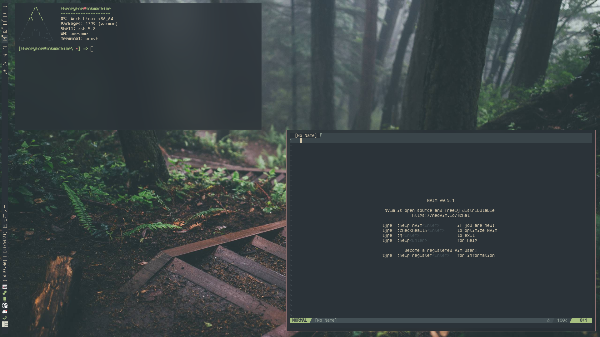

---
title:
	"ricing.rocks"
---

::: {#nav}
[Home](index.html){#nav-item}
[Ricing Resources](resources.html){#nav-item}
[Guides Index](guide_index.html){#nav-item}
:::

::: {#content .content}

# Restoring knowledge in ricing: ricing.rocks!

Welcome to ricing.rocks, a site meant to be a more focused "guide" on ricing in Unix and Unix-Like systems.
If you are new to Ricing, this is a great place for you to start. Please be aware that this is by no means a complete or
full guide on ricing, as there is too much in the real of ricing to be covered by one guide (let alone on site).

:::: {#image-container}

{width=50%}

::::

## What exactly is ricing?
This is a question that many who are new to the Linux (and Unix) world ask quite often and I will attempt to give the best definition.

> *Ricing is the action of configuring a Linux desktop to suit to the user's personal needs,
> where things like layout, colors, keybinds, behavior, and software are all tailor-picked
> to the ricer's end needs.*

This is the essence of what ricing is. Many have different goals when it comes to ricing, whether they want a cool and slick desktop, or a productive work-tailored experience.
Ricing is all about taking the tools and using them to suit your needs.

## Where can I get started?
This site has a host of various guides, but if you are completely new to Linux, you will want to check out this:

- [A basic overview of Linux](articles/linux_overview.html)

If you are already familiar with Linux and want to get strait into the meat, start here:

- [Creating your first rice](articles/first_rice/first_rice.html)

Some other interesting articles:

## What is this site for?
This site is aimed to be a resource for those who want to rice their system,
or those who want to learn a bit more about the Linux and Unix-based operating system.

## I know stuff, how can I contribute to this project?
Contributors are always welcome! There are many ways you can contribute to the project

:::

::: {#footer .footer}
[Contribute](https://github.com/theory-of-everything/ricing-rocks)
[License](https://www.gnu.org/licenses/agpl-3.0.txt)
[Privacy](privacy.html)
:::

<!-- # vim: fdm=marker:filetype=markdown:ts=4:shiftwidth=4:expandtab! -->
